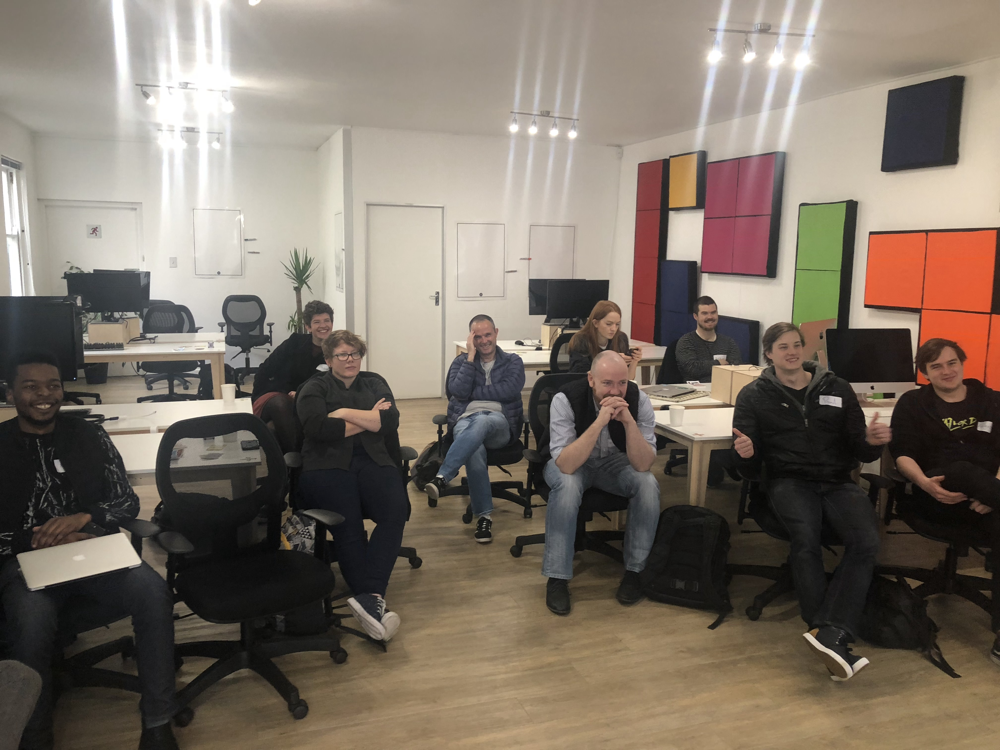

# DeathCard
[Rozanne de Jager](https://www.linkedin.com/in/zangraphic/) and I created this application during the [Build an augmented reality app on Root insurance](https://make.offerzen.com/course/root-insurance-augmented-reality) course, at [Make by OfferZen](https://make.offerzen.com/). It was a great day, and doing work with Augmented Reality is so tangible and cool.

We built this application on top of the [Kikr](https://github.com/OfferZen-Make/arinsuretech-kicker) boilerplate setup by [Herman](https://github.com/HermanMartinus) and [Jojo](https://github.com/jonatasbaldin).

To see our app in action check [this](https://photos.app.goo.gl/kz9NaCYVqfBFJCqj8) out.

Huge thanks to Offerzen, Root and Make for putting together such an awesome day.

## Make Day Alpha Papa Team
